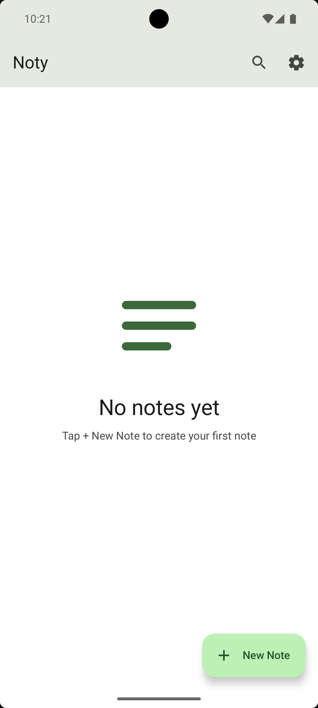
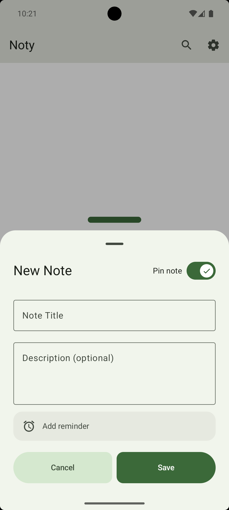
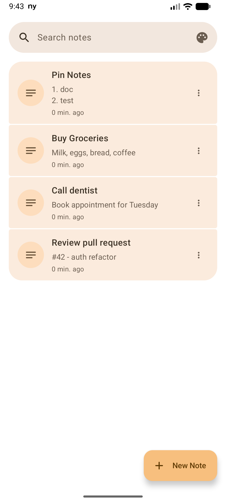
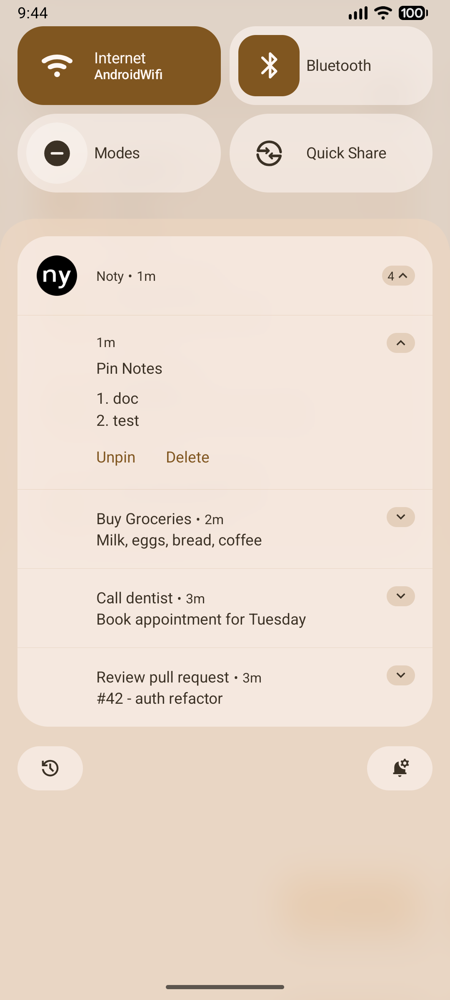
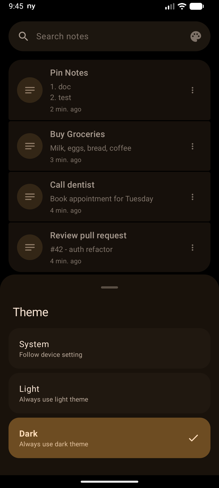

# Noty — Notes in Your Notification Shade

<p align="center">
  <a href="https://github.com/usamaiqb/noty/actions/workflows/ci.yml"></a>
  <a href="https://f-droid.org/packages/com.noty.app/"></a>
  
  
  <a href="https://www.gnu.org/licenses/gpl-3.0"></a>
</p>

A simple, privacy-focused notes app for Android that keeps your notes exactly where you look dozens of times a day — your notification shade.

## Features

- 📌 **Persistent Notifications** — Every note appears as a notification that stays in your status bar until you're done with it
- 🔄 **Survives Restarts** — Notes are restored automatically after a phone restart
- ✏️ **Add, Edit, Delete** — Create notes with a title and optional description; edit or delete any note with a tap
- 📌 **Pin or Unpin Anytime** — Choose which notes appear as notifications; unpin a note and it moves back to the app without a notification
- ⚡ **Quick Settings Tile** — Add a "Quick Note" tile to your Quick Settings panel to open the add-note screen
- 🔍 **Search** — Filter notes by title or description
- 🎨 **Material You** — Material 3 with dynamic color on Android 12+; Light, Dark, and System themes
- 🔒 **100% Private** — No accounts, no cloud, no network access; your notes never leave your device

## Screenshots

<p align="center">
  
  
  
  
  
</p>

## Download

### F-Droid

[](https://f-droid.org/packages/com.noty.app/)

### GitHub Releases

Download the latest APK from the [Releases](https://github.com/usamaiqb/noty/releases) page.

## Requirements

- Android 8.0 (Oreo) or higher

## Permissions

Noty requests only the permissions it needs:

- **POST_NOTIFICATIONS** — To show your notes as persistent notifications
- **RECEIVE_BOOT_COMPLETED** — To restore notes after a phone restart
- **FOREGROUND_SERVICE** — To keep notifications active in the background

No internet permission. No location. No data collection.

## Building from Source

### Prerequisites

- Android Studio Meerkat (2024.3.1) or later
- JDK 17
- Android SDK API level 35

### Build Steps

1. Clone the repository:
```bash
git clone https://github.com/usamaiqb/noty.git
cd noty
```

2. Open in Android Studio or build from the command line:
```bash
./gradlew assembleRelease
```

3. The APK will be in `app/build/outputs/apk/release/`

## Privacy

Noty:
- ✅ Does NOT collect any personal data
- ✅ Does NOT require internet access
- ✅ Does NOT contain ads or tracking
- ✅ Does NOT share data with third parties
- ✅ All data is stored locally on your device

For full details, see the [Privacy Policy](PRIVACY_POLICY.md).

## Support

- **Issues**: [GitHub Issues](https://github.com/usamaiqb/noty/issues)
- **Discussions**: [GitHub Discussions](https://github.com/usamaiqb/noty/discussions)

## License

This project is licensed under the GNU General Public License v3.0 — see the [LICENSE](LICENSE) file for details.

## Built With

- [Kotlin](https://kotlinlang.org/) — Modern programming language for Android
- [Jetpack Compose](https://developer.android.com/compose) — Declarative UI toolkit
- [Room](https://developer.android.com/training/data-storage/room) — Local database
- [Material Design 3](https://m3.material.io/) — Modern design system
- [Kotlin Coroutines](https://kotlinlang.org/docs/coroutines-overview.html) — Asynchronous programming

## Changelog

See [CHANGELOG.md](CHANGELOG.md) for version history and changes.

---

Made with ❤️ for the open source community
